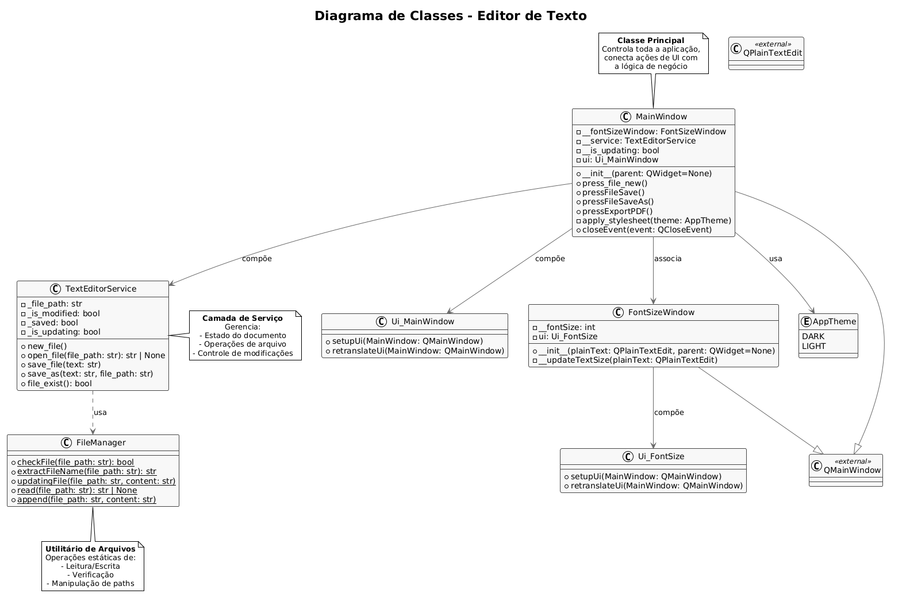

## Overview
This is a simple text editor made in Python using Pyside6 (Qt Framework) to develop the GUI and qt-linguist to switch application language dinamically.

## Instructions

This how I converted GUI Qt designer files into python files to integrate them in the project

```shell
pyside6-uic UIMainWindow.ui -o UIMainWindow.py
```
This command below opens Qt Linguist
```shell
pyside6-linguist
```
This one creates the `.ts` file

```shell
 pyside6-lupdate UIClasses/Window.py -ts Translations/pt_BR.ts
```

This one creates the `.qm` file based on the `.ts` file

```shell
pyside6-lrelease Translations/pt_BR.ts -qm pt_BR.qm 
```

### How the translation system is working here

#### AppStrings.py 
There is a file called `AppStrings.py` responsible to have all the app's strings. There is a snippet of it below.

```python
class AppStrings:
    # MainWindow
    WINDOW_TITLE = ("MainWindow", "Text Editor")
    OPEN_FILE = ("MainWindow", "Open file")
    SAVING_FILE = ("MainWindow", "Saving File")
    EXPORT_PDF = ("MainWindow", "Export PDF")
    EXPORT_COMPLETED = ("MainWindow", "Export Completed")

    # ExportDialog
    FILE_SAVED = ("ExportDialog", "File saved in {0}")
    EXPORT_ERROR = ("ExportDialog", "Error of Exporting")
    EXPORT_ERROR_MESSAGE = ("ExportDialog", "Not possible to export PDF file.\nError: ")

    # Close Event
    PROGRAM_NAME = ("MainWindow", "Text Editor")
    SAVE_CHANGES_QUESTION = ("MainWindow", "Do you want to save the changes?")

    # Menus
    MENU_FILE = ("MainWindow", "File")
    MENU_EDIT = ("MainWindow", "Edit")
    MENU_APPEARANCE = ("MainWindow", "Appearance")
    MENU_LANGUAGE = ("MainWindow", "Language")
```
Each line describes a context and the string istself that should be get. For example: in `MENU_EDIT` the context is "MainWindow" and the string content is "Edit". This information is important for the `.qm` file (generated by a `.ts` file) in order to translate everything correctly. 

#### .qm and .ts files

Take a look on the `.ts` files's snippet below:

```xml
    <message>
            <location filename="../Utils/AppStrings.py" line="id:menu_edit"/>
            <source>Edit</source>
            <translation>Editar</translation>
    </message>
```
The context in `AppStrings.py` is important here, because `.qm` needs to find in the context "MainWindow" the source "Edit". The translation tag indicates the content the string that `.qm` is going to use, in the example it is in portuguese ("Editar"). When tha language changes, another `.qm` file is loaded with another string instead of "Editar". 


#### MainWindow handling with translation

`MainWindow` uses `AppStrings.py` to set the strings in UI. In the example below it uses `*AppStrings.MENU_FILE` which unpack `MENU_FILE` into its content, which is `("MainWindow", "File")`.

```python
self.ui.menuFile.setTitle(QCoreApplication.translate(*AppStrings.MENU_FILE))
```

In this context, the command `QCoreApplication.translate(*AppStrings.MENU_FILE)` will make the `.qm` file search in the context "MainWindow" for the tag "Edit" and return the string in "translation" tag instead of the string content "Edit" in `AppStrings.py`. That is the reason why in `MainWindow` class the method to apply the translation in UI is like below:

```python
def retranslateUi(self):
        self.setWindowTitle(QCoreApplication.translate("MainWindow", "Text Editor"))

        self.Export_pdf = AppStrings.EXPORT_PDF

        self.ui.menuFile.setTitle(QCoreApplication.translate(*AppStrings.MENU_FILE))
        self.ui.actionNew.setText(QCoreApplication.translate(*AppStrings.ACTION_NEW))
```

 

## Class Diagram here: (In Progress)

https://lucid.app/lucidchart/b3bc5f04-7113-4b4d-bba3-53429326a05e/edit?invitationId=inv_cd46ab9e-c2cd-4486-b359-e808e8bd015f&page=HWEp-vi-RSFO#

## PlantUML Code (In Progress)

```shell
@startuml
!theme plain

skinparam class {
    BackgroundColor #F8F8F8
    BorderColor #444
    ArrowColor #666
    FontName Helvetica
}

skinparam defaultTextAlignment center

title Diagrama de Classes - Editor de Texto

' 1. Classes de UI
class Ui_MainWindow {
  + setupUi(MainWindow: QMainWindow)
  + retranslateUi(MainWindow: QMainWindow)
}

class Ui_FontSize {
  + setupUi(MainWindow: QMainWindow)
  + retranslateUi(MainWindow: QMainWindow)
}

class FontSizeWindow {
  - __fontSize: int
  - ui: Ui_FontSize
  + __init__(plainText: QPlainTextEdit, parent: QWidget=None)
  - __updateTextSize(plainText: QPlainTextEdit)
}

' 2. Classes de Serviço
class TextEditorService {
  - _file_path: str
  - _is_modified: bool
  - _saved: bool
  - _is_updating: bool
  + new_file()
  + open_file(file_path: str): str | None
  + save_file(text: str)
  + save_as(text: str, file_path: str)
  + file_exist(): bool
}

class FileManager {
  + {static} checkFile(file_path: str): bool
  + {static} extractFileName(file_path: str): str
  + {static} updatingFile(file_path: str, content: str)
  + {static} read(file_path: str): str | None
  + {static} append(file_path: str, content: str)
}

' 3. Classes de Aparência
enum AppTheme {
  DARK
  LIGHT
}

' 4. Classe Principal
class MainWindow {
  - __fontSizeWindow: FontSizeWindow
  - __service: TextEditorService
  - __is_updating: bool
  - ui: Ui_MainWindow
  + __init__(parent: QWidget=None)
  + press_file_new()
  + pressFileSave()
  + pressFileSaveAs()
  + pressExportPDF()
  - apply_stylesheet(theme: AppTheme)
  + closeEvent(event: QCloseEvent)
}

' 5. Relacionamentos
MainWindow --> Ui_MainWindow : compõe
MainWindow --> TextEditorService : compõe
MainWindow --> FontSizeWindow : associa
MainWindow --> AppTheme : usa

FontSizeWindow --> Ui_FontSize : compõe

TextEditorService ..> FileManager : usa

' 6. Classes Qt (simplificadas)
class QMainWindow <<external>> {
  __
}

class QPlainTextEdit <<external>> {
  __
}

MainWindow --|> QMainWindow
FontSizeWindow --|> QMainWindow

' 7. Notas explicativas
note top of MainWindow
  **Classe Principal**
  Controla toda a aplicação,
  conecta ações de UI com
  a lógica de negócio
end note

note right of TextEditorService
  **Camada de Serviço**
  Gerencia:
  - Estado do documento
  - Operações de arquivo
  - Controle de modificações
end note

note bottom of FileManager
  **Utilitário de Arquivos**
  Operações estáticas de:
  - Leitura/Escrita
  - Verificação
  - Manipulação de paths
end note

@enduml
```

## Image 


## Issues

Currently the messages in other context windows such as Export PDF are not having their strings' content being changed for some reason.
